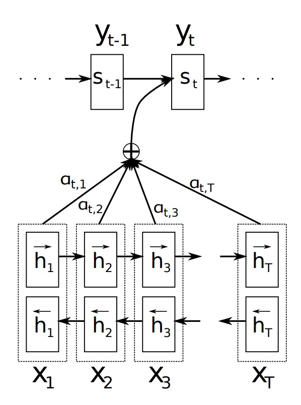
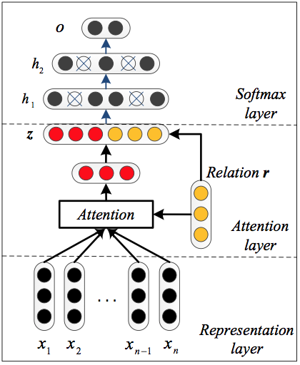
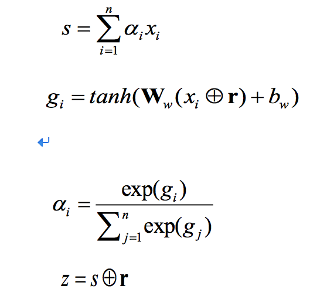

# LSTM_Attention

    X = Input Sequence of length n.
    H = LSTM(X); Note that here the LSTM has return_sequences = True,
        so H is a sequence of vectors of length n.
    s is the hidden state of the LSTM (h and c)
    
    h is a weighted sum over H: 加权和
    h = sigma(j = 0 to n-1)  alpha(j) * H(j)
    
    weight alpha[i, j] for each hj is computed as follows:
    H = [h1,h2,...,hn]
    M = tanh(H)
    alhpa = softmax(w.transpose * M)
    
    h# = tanh(h)
    y = softmax(W * h# + b)
    
    J(theta) = negative_log_likelihood + regularity

### attModel1

GitHub 项目

[datalogue/keras-attention](https://github.com/datalogue/keras-attention/blob/master/models/custom_recurrents.py)

### attModel2

GitHub 项目

[Keras Attention Mechanism](https://github.com/philipperemy/keras-attention-mechanism)

Example: Attention block*

**Attention defined per time series (each TS has its own attention)**

# attModel3

Github 项目

[keras-language-modeling](https://github.com/codekansas/keras-language-modeling/blob/master/keras_models.py)

https://github.com/roebius/deeplearning_keras2/blob/master/nbs2/attention_wrapper.py

# attModel4

Github 项目

[**CDRextraction**](https://github.com/Xls1994/CDRextraction/blob/master/customize_layer.py)

# hierarchical-attention-networks

Github：

[synthesio/hierarchical-attention-networks](https://github.com/synthesio/hierarchical-attention-networks)

# self-attention-networks

### 参考

- https://github.com/Xls1994/CDRextraction/blob/master/customize_layer.py
  - AttentivePoolingLayer
- [深度学习笔记——Attention Model（注意力模型）学习总结](https://blog.csdn.net/mpk_no1/article/details/72862348)

