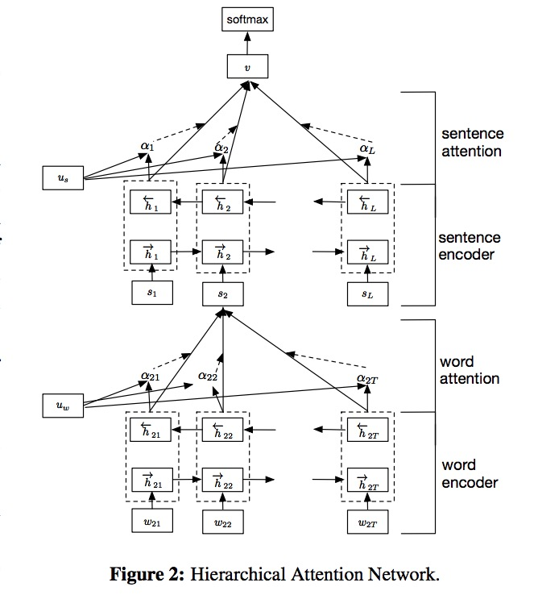

# hierarchical-attention-networks
Github：

[synthesio/hierarchical-attention-networks](https://github.com/synthesio/hierarchical-attention-networks)

Implementation of Hierarchical Attention Networks as presented in https://www.cs.cmu.edu/~diyiy/docs/naacl16.pdf

imdb_train.py trains the model with the IMDB sentiment data. 

The input data for the model is ( batch docs, sentence, words). IMDB data contains a "sentence" per document, so we had an extra dimension as sentence.  

